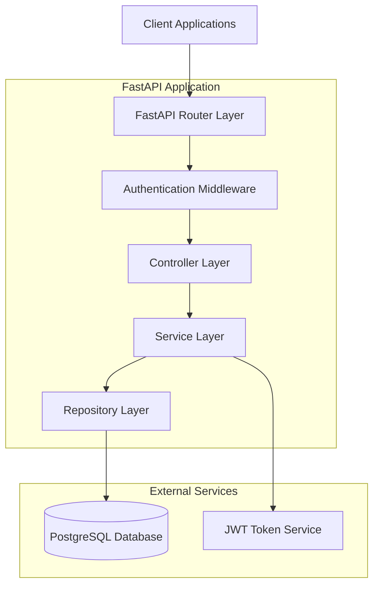

# TODO API Design Document

## Overview

This document outlines the design for a REST API built with FastAPI and PostgreSQL to manage TODO tasks. The system supports multi-user functionality with JWT authentication, ensuring each user can only access their own tasks. The design prioritizes scalability, security, and maintainability to handle high concurrency and large data volumes.

### Key Features
- CRUD operations for TODO tasks
- JWT-based authentication
- Multi-user support with data isolation
- PostgreSQL for persistent storage
- Async SQLAlchemy ORM
- Database migrations with Alembic
- Error handling and validation
- Dockerized deployment

## Architecture



### Layer Responsibilities

| Layer | Responsibility |
|-------|---------------|
| **Router** | HTTP endpoint definitions, request/response handling |
| **Authentication** | JWT token validation, user identification |
| **Controller** | Request validation, response formatting |
| **Service** | Business logic, data transformation |
| **Repository** | Data access, database operations |

## Pydantic Models & Validation

### Request/Response Schemas

#### Authentication Schemas
```python
class LoginRequest(BaseModel):
    username: str = Field(..., min_length=3, max_length=50, description="Username")
    password: str = Field(..., min_length=6, description="Password")
    
    class Config:
        json_schema_extra = {
            "example": {
                "username": "johndoe",
                "password": "securepassword123"
            }
        }

class TokenResponse(BaseModel):
    access_token: str = Field(..., description="JWT access token")
    token_type: str = Field(default="bearer", description="Token type")
    expires_in: int = Field(..., description="Token expiration time in seconds")
```

#### Task Schemas
```python
class TaskBase(BaseModel):
    titulo: str = Field(..., min_length=1, max_length=200, description="Task title")
    descripcion: Optional[str] = Field(None, max_length=1000, description="Task description")
    estado: TaskStatus = Field(default=TaskStatus.PENDIENTE, description="Task status")

class TaskCreate(TaskBase):
    class Config:
        json_schema_extra = {
            "example": {
                "titulo": "Complete project documentation",
                "descripcion": "Write comprehensive API documentation",
                "estado": "pendiente"
            }
        }

class TaskUpdate(BaseModel):
    titulo: Optional[str] = Field(None, min_length=1, max_length=200)
    descripcion: Optional[str] = Field(None, max_length=1000)
    estado: Optional[TaskStatus] = None
    
    @validator('titulo')
    def validate_titulo(cls, v):
        if v is not None and not v.strip():
            raise ValueError('Title cannot be empty or whitespace only')
        return v.strip() if v else v

class TaskResponse(TaskBase):
    id: UUID = Field(..., description="Task unique identifier")
    fecha_creacion: datetime = Field(..., description="Task creation timestamp")
    fecha_actualizacion: Optional[datetime] = Field(None, description="Last update timestamp")
    id_usuario: UUID = Field(..., description="Owner user ID")
    
    class Config:
        from_attributes = True
        json_encoders = {
            datetime: lambda v: v.isoformat(),
            UUID: lambda v: str(v)
        }

class TaskListResponse(BaseModel):
    tasks: List[TaskResponse] = Field(..., description="List of tasks")
    total: int = Field(..., description="Total number of tasks")
    limit: int = Field(..., description="Maximum number of tasks returned")
    offset: int = Field(..., description="Number of tasks skipped")
    
class TaskFilters(BaseModel):
    limit: int = Field(default=100, ge=1, le=1000, description="Items per page")
    offset: int = Field(default=0, ge=0, description="Number of items to skip")
    estado: Optional[TaskStatus] = Field(None, description="Filter by task status")
    search: Optional[str] = Field(None, max_length=100, description="Search in title and description")
    sort_by: Optional[str] = Field(default="fecha_creacion", regex="^(fecha_creacion|titulo|estado)$")
    sort_order: Optional[str] = Field(default="desc", regex="^(asc|desc)$")
```

### Custom Validators
```python
class TaskValidators:
    @staticmethod
    def validate_task_ownership(task: Task, user_id: UUID) -> bool:
        """Validate that task belongs to the specified user"""
        return task.id_usuario == user_id
    
    @staticmethod
    def validate_status_transition(current_status: TaskStatus, new_status: TaskStatus) -> bool:
        """Validate allowed status transitions"""
        allowed_transitions = {
            TaskStatus.PENDIENTE: [TaskStatus.COMPLETADA],
            TaskStatus.COMPLETADA: [TaskStatus.PENDIENTE]
        }
        return new_status in allowed_transitions.get(current_status, [])
```

## API Endpoints Reference

### Authentication Endpoints

#### POST /auth/login
**Purpose:** Authenticate user and return JWT token

**Request Schema:** `LoginRequest`
**Response Schema:** `TokenResponse`

**Status Codes:**
- 200: Authentication successful
- 401: Invalid credentials
- 422: Validation error

### Task Management Endpoints

#### POST /tasks
**Purpose:** Create a new task

**Authentication Required:** Yes (JWT Bearer token)

**Request Schema:** `TaskCreate`
**Response Schema:** `TaskResponse`

**Validation Rules:**
- titulo: Required, 1-200 characters
- descripcion: Optional, max 1000 characters
- estado: Optional, defaults to "pendiente"

#### GET /tasks
**Purpose:** List all tasks for authenticated user

**Authentication Required:** Yes

**Query Parameters:** `TaskFilters` (as query parameters)
**Response Schema:** `TaskListResponse`

**Advanced Filtering:**
- Pagination with limit/offset validation
- Full-text search in title and description
- Status filtering with enum validation
- Sorting by multiple fields with direction control

#### GET /tasks/{id}
**Purpose:** Get specific task by ID

**Authentication Required:** Yes

**Path Parameters:**
- `id` (UUID): Task identifier with automatic UUID validation

**Response Schema:** `TaskResponse`

**Status Codes:**
- 200: Task found
- 404: Task not found or access denied
- 422: Invalid UUID format

#### PUT /tasks/{id}
**Purpose:** Update existing task

**Authentication Required:** Yes

**Request Schema:** `TaskUpdate`
**Response Schema:** `TaskResponse`

**Validation Rules:**
- Partial update validation (only provided fields)
- Status transition validation
- Ownership verification

#### DELETE /tasks/{id}
**Purpose:** Delete task

**Authentication Required:** Yes

**Response Schema:**
```python
class DeleteResponse(BaseModel):
    message: str = Field(..., description="Deletion confirmation message")
    deleted_at: datetime = Field(..., description="Deletion timestamp")
```

## Data Models & ORM Mapping

### User Model
```python
class User(Base):
    __tablename__ = "users"
    
    id: UUID = Column(UUID, primary_key=True, default=uuid4)
    username: str = Column(String(50), unique=True, nullable=False)
    email: str = Column(String(100), unique=True, nullable=False)
    hashed_password: str = Column(String(255), nullable=False)
    created_at: datetime = Column(DateTime, default=datetime.utcnow)
    is_active: bool = Column(Boolean, default=True)
    
    # Relationship
    tasks = relationship("Task", back_populates="user")
```

### Task Model
```python
class Task(Base):
    __tablename__ = "tasks"
    
    id: UUID = Column(UUID, primary_key=True, default=uuid4)
    titulo: str = Column(String(200), nullable=False)
    descripcion: str = Column(Text, nullable=True)
    estado: TaskStatus = Column(Enum(TaskStatus), default=TaskStatus.PENDIENTE)
    fecha_creacion: datetime = Column(DateTime, default=datetime.utcnow)
    fecha_actualizacion: datetime = Column(DateTime, onupdate=datetime.utcnow)
    id_usuario: UUID = Column(UUID, ForeignKey("users.id"), nullable=False)
    
    # Relationship
    user = relationship("User", back_populates="tasks")
    
    # Indexes for performance
    __table_args__ = (
        Index("idx_tasks_user_id", "id_usuario"),
        Index("idx_tasks_estado", "estado"),
        Index("idx_tasks_fecha_creacion", "fecha_creacion"),
    )
```

### Enums and Types
```python
class TaskStatus(str, Enum):
    PENDIENTE = "pendiente"
    COMPLETADA = "completada"
```

## Business Logic Layer

### SOLID Principles Implementation

#### Single Responsibility Principle (SRP)
Each class has a single, well-defined responsibility:

```python
# Task Repository - Only handles data access
class TaskRepository:
    async def create(self, task_data: dict) -> Task
    async def get_by_id(self, task_id: UUID, user_id: UUID) -> Optional[Task]
    async def get_by_user(self, user_id: UUID, filters: TaskFilters) -> List[Task]
    async def update(self, task_id: UUID, updates: dict) -> Task
    async def delete(self, task_id: UUID) -> bool

# Task Service - Only handles business logic
class TaskService:
    async def create_task(self, task_data: TaskCreate, user_id: UUID) -> TaskResponse
    async def get_user_tasks(self, user_id: UUID, filters: TaskFilters) -> TaskListResponse
    async def update_task(self, task_id: UUID, updates: TaskUpdate, user_id: UUID) -> TaskResponse
    async def delete_task(self, task_id: UUID, user_id: UUID) -> bool

# Task Controller - Only handles HTTP concerns
class TaskController:
    async def create_task_endpoint(self, task_data: TaskCreate, current_user: User)
    async def get_tasks_endpoint(self, filters: TaskFilters, current_user: User)
```

#### Open/Closed Principle (OCP)
System is open for extension, closed for modification:

```python
# Abstract base for task filters
class BaseTaskFilter(ABC):
    @abstractmethod
    async def apply(self, query: Query, value: Any) -> Query:
        pass

# Concrete filter implementations
class StatusFilter(BaseTaskFilter):
    async def apply(self, query: Query, status: TaskStatus) -> Query:
        return query.where(Task.estado == status)

class SearchFilter(BaseTaskFilter):
    async def apply(self, query: Query, search_term: str) -> Query:
        return query.where(
            or_(
                Task.titulo.ilike(f"%{search_term}%"),
                Task.descripcion.ilike(f"%{search_term}%")
            )
        )

# Filter factory for extensibility
class TaskFilterFactory:
    _filters = {
        'estado': StatusFilter(),
        'search': SearchFilter(),
        # Easy to add new filters without modifying existing code
    }
```

#### Liskov Substitution Principle (LSP)
Implementations are substitutable for their abstractions:

```python
# Abstract repository interface
class ITaskRepository(ABC):
    @abstractmethod
    async def create(self, task_data: dict) -> Task:
        pass
    
    @abstractmethod
    async def get_by_id(self, task_id: UUID, user_id: UUID) -> Optional[Task]:
        pass

# PostgreSQL implementation
class PostgreSQLTaskRepository(ITaskRepository):
    async def create(self, task_data: dict) -> Task:
        # PostgreSQL-specific implementation
        pass

# In-memory implementation for testing
class InMemoryTaskRepository(ITaskRepository):
    async def create(self, task_data: dict) -> Task:
        # In-memory implementation
        pass
```

#### Interface Segregation Principle (ISP)
Clients depend only on interfaces they use:

```python
# Separate interfaces for different concerns
class ITaskReader(ABC):
    @abstractmethod
    async def get_by_id(self, task_id: UUID) -> Optional[Task]:
        pass
    
    @abstractmethod
    async def get_by_user(self, user_id: UUID) -> List[Task]:
        pass

class ITaskWriter(ABC):
    @abstractmethod
    async def create(self, task_data: dict) -> Task:
        pass
    
    @abstractmethod
    async def update(self, task_id: UUID, updates: dict) -> Task:
        pass
    
    @abstractmethod
    async def delete(self, task_id: UUID) -> bool:
        pass

# Read-only service for reporting
class TaskReportService:
    def __init__(self, task_reader: ITaskReader):
        self._task_reader = task_reader
```

#### Dependency Inversion Principle (DIP)
High-level modules don't depend on low-level modules:

```python
# High-level service depends on abstraction
class TaskService:
    def __init__(
        self,
        task_repository: ITaskRepository,
        user_service: IUserService,
        notification_service: INotificationService
    ):
        self._task_repository = task_repository
        self._user_service = user_service
        self._notification_service = notification_service
```

### Design Patterns Implementation

#### Repository Pattern
```python
class TaskRepository:
    def __init__(self, db_session: AsyncSession):
        self._db = db_session
    
    async def create(self, task_data: dict) -> Task:
        task = Task(**task_data)
        self._db.add(task)
        await self._db.commit()
        await self._db.refresh(task)
        return task
    
    async def get_by_id_and_user(self, task_id: UUID, user_id: UUID) -> Optional[Task]:
        result = await self._db.execute(
            select(Task).where(
                and_(Task.id == task_id, Task.id_usuario == user_id)
            )
        )
        return result.scalar_one_or_none()
```

#### Factory Pattern
```python
class TaskServiceFactory:
    @staticmethod
    def create_task_service(
        db_session: AsyncSession,
        cache_client: Optional[Redis] = None
    ) -> TaskService:
        # Create repository
        task_repository = TaskRepository(db_session)
        
        # Create caching decorator if cache is available
        if cache_client:
            task_repository = CachedTaskRepository(task_repository, cache_client)
        
        # Create and return service
        return TaskService(task_repository)
```

#### Decorator Pattern (for Caching)
```python
class CachedTaskRepository:
    def __init__(self, repository: ITaskRepository, cache: Redis):
        self._repository = repository
        self._cache = cache
    
    async def get_by_id(self, task_id: UUID, user_id: UUID) -> Optional[Task]:
        cache_key = f"task:{task_id}:{user_id}"
        
        # Try cache first
        cached_data = await self._cache.get(cache_key)
        if cached_data:
            return Task.parse_raw(cached_data)
        
        # Fallback to repository
        task = await self._repository.get_by_id(task_id, user_id)
        if task:
            await self._cache.setex(
                cache_key, 
                300,  # 5 minutes TTL
                task.json()
            )
        
        return task
```

#### Strategy Pattern (for Task Notifications)
```python
class NotificationStrategy(ABC):
    @abstractmethod
    async def send_notification(self, user: User, message: str) -> bool:
        pass

class EmailNotificationStrategy(NotificationStrategy):
    async def send_notification(self, user: User, message: str) -> bool:
        # Email notification implementation
        pass

class PushNotificationStrategy(NotificationStrategy):
    async def send_notification(self, user: User, message: str) -> bool:
        # Push notification implementation
        pass

class TaskNotificationService:
    def __init__(self, strategy: NotificationStrategy):
        self._strategy = strategy
    
    async def notify_task_completed(self, task: Task, user: User):
        message = f"Task '{task.titulo}' has been completed!"
        await self._strategy.send_notification(user, message)
```

#### Observer Pattern (for Task Events)
```python
class TaskEventObserver(ABC):
    @abstractmethod
    async def on_task_created(self, task: Task) -> None:
        pass
    
    @abstractmethod
    async def on_task_completed(self, task: Task) -> None:
        pass

class TaskAuditObserver(TaskEventObserver):
    async def on_task_created(self, task: Task) -> None:
        # Log task creation for audit
        logger.info(f"Task created: {task.id} by user {task.id_usuario}")
    
    async def on_task_completed(self, task: Task) -> None:
        # Log task completion
        logger.info(f"Task completed: {task.id}")

class TaskService:
    def __init__(self, repository: ITaskRepository):
        self._repository = repository
        self._observers: List[TaskEventObserver] = []
    
    def add_observer(self, observer: TaskEventObserver):
        self._observers.append(observer)
    
    async def complete_task(self, task_id: UUID, user_id: UUID) -> TaskResponse:
        task = await self._repository.update(
            task_id, 
            {"estado": TaskStatus.COMPLETADA}
        )
        
        # Notify observers
        for observer in self._observers:
            await observer.on_task_completed(task)
        
        return TaskResponse.from_orm(task)
```

## Middleware & Interceptors

### Authentication Middleware
```python
class JWTAuthMiddleware:
    async def authenticate_request(self, request: Request):
        # Extract Bearer token from Authorization header
        # Validate JWT token signature and expiration
        # Extract user information from token payload
        # Add user context to request state
```

### Error Handling Middleware
```python
class ErrorHandlingMiddleware:
    async def handle_errors(self, request: Request, call_next):
        # Catch and format application exceptions
        # Log errors for monitoring
        # Return standardized error responses
        # Handle database connection errors
```

### Request Logging Middleware
```python
class RequestLoggingMiddleware:
    async def log_requests(self, request: Request, call_next):
        # Log incoming requests with timestamps
        # Track response times
        # Log user actions for audit trail
        # Monitor API usage patterns
```

### Rate Limiting Middleware
```python
class RateLimitingMiddleware:
    async def enforce_rate_limits(self, request: Request):
        # Implement user-based rate limiting
        # Prevent API abuse
        # Return 429 status for exceeded limits
```

## Testing Strategy

### Unit Testing Structure

#### Repository Layer Tests
- Database operation mocking
- Query result validation
- Error handling verification
- Connection pool testing

#### Service Layer Tests
- Business logic validation
- Authorization rule testing
- Data transformation verification
- Error propagation testing

#### Controller Layer Tests
- Request/response validation
- HTTP status code verification
- Authentication integration testing
- Input sanitization testing

### Integration Testing

#### Database Integration Tests
```python
class TestTaskRepository:
    async def test_create_task_success(self):
        # Test successful task creation
        # Verify database state changes
        # Check generated fields (ID, timestamp)
    
    async def test_create_task_duplicate_handling(self):
        # Test handling of constraint violations
    
    async def test_get_tasks_with_filters(self):
        # Test complex query filtering
        # Verify pagination functionality
        # Test performance with large datasets
```

#### API Integration Tests
```python
class TestTaskAPI:
    async def test_create_task_authenticated(self):
        # Test full API flow with JWT authentication
        # Verify request/response format
        # Test error scenarios
    
    async def test_unauthorized_access(self):
        # Test access without valid JWT
        # Test access to other user's tasks
        # Verify security measures
```

### Performance Testing
- Load testing with multiple concurrent users
- Database query performance testing
- Memory usage monitoring
- Response time benchmarking

### Security Testing
- JWT token validation testing
- SQL injection prevention testing
- Authorization bypass attempt testing
- Input validation security testing